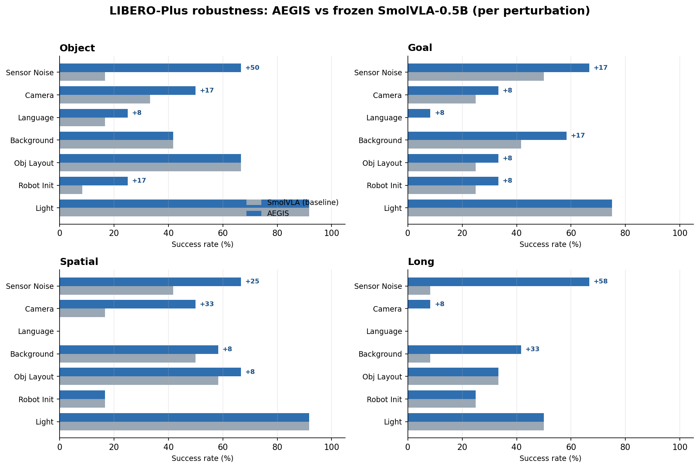

<div align="center">

# AEGIS
### Adaptive Entropy-Gated Information Sieve
#### Additive, Provably-Safe Robustness for Frozen Vision-Language-Action Policies

**A rate-limited information bottleneck applied at two interfaces of a *frozen* VLA — perception and action — both exact pass-throughs at initialization, so robustness is strictly additive and per-suite gating is provably safe.**

> 📋 **[RESULTS_STATUS.md](RESULTS_STATUS.md)** — honest snapshot of what's complete and how it was measured. The full LIBERO-Plus table (4 suites × 3 seeds, n=84/cell) is now complete.

[]()
[]()
[]()
[]()

***AEGIS** — **A**daptive **E**ntropy-**G**ated **I**nformation **S**ieve = **RIB** (perception) + **RASF** (action) + **TE** (temporal consensus). External label "SmolVLA+SIB".*

<br/>


</div>

---

## TL;DR

Vision-Language-Action (VLA) models collapse under the visual and dynamical perturbations any real deployment guarantees — motion blur, sensor noise, lighting and viewpoint shift. Existing robustness fixes either **retrain the backbone** (expensive, risks the clean-task competence the model was bought for) or **bolt on heuristics that can silently degrade clean success**.

**AEGIS is a third option.** We insert a *rate-limited information bottleneck* at two interfaces inside a **completely frozen** VLA — the **vision→LLM connector** (perception) and the **sampled action chunk** (action) — and we **initialize both as exact identities**. Before any learning, the augmented policy is bit-for-bit the base policy. Robustness is therefore *strictly additive*: clean success cannot structurally degrade, and a module that doesn't help on a given suite can be turned off to recover the base policy **exactly** — not approximately. That single property — *identity at initialization* — is what makes the whole system safe to deploy and safe to gate.

> **One principle, two interfaces, one consensus.** Compress away what corruption lives in; keep everything the policy actually uses; never touch the backbone.

**Headline numbers (LIBERO, SmolVLA backbone, single seed):**

| Setting | Result |
|---|---|
| **Clean SR** (4-suite, strict `n_action_steps=1`, per-suite gating) | **+1.75** vs base — never below base on any suite |
| **Robustness — Spatial, 6 axes, n=200/axis** | wins **all 6**, mean **+14.1** |
| **Robustness — Object+Goal cross-suite, 10 conditions** | mean **+29.9**, **0 regressions** |
| **Graceful degradation** (Gaussian σ-sweep) | base dies (0/200) at σ≥0.30; AEGIS still completes 24.5% |
| **Trainable params** | RIB ≈ 2.27M · RASF ≈ few-k · backbone **0** |

---

## Why this matters

The robustness literature for robot policies is full of methods that improve corrupted-input performance **and quietly cost you clean-input performance** — an unfavorable trade when the clean task is the product. AEGIS is built so that trade *cannot happen by construction*:

1. **Identity at init** — RIB (`fusion_scale = 0`) and RASF (`gate_max = 0`) produce a forward pass *identical* to the stock policy at step 0. Learning can only add a bounded, gated correction.
2. **Strictly additive robustness** — every reported Δ is a gain layered on top of an honest baseline (`SmolVLA + TE`), never a re-tuned model.
3. **Provably-safe gating** — because "off" is the base policy *exactly*, you can disable a module per-suite with zero risk. This is how we guarantee **0 regressions** across the cross-suite sweep.
4. **Post-hoc & cheap** — both modules train on *cached* policy outputs; the frozen vision encoder, connector, and flow-matching action expert are never differentiated through.

---

## Method

```
┌──────────────────────────────────────────────────────────────────────────────┐
│                        SmolVLA  (backbone FROZEN)                              │
│                                                                                │
│  RGB obs ─▶ Vision Encoder (frozen) ─▶ patch tokens                            │
│                                     │                                          │
│ ◀ PERCEPTION INTERFACE ▶  RIB  (~2.27M, info-bottleneck @ vision→LLM connector)│
│            pass-through at init · localises WHERE a corruption sits            │
│                                     │ corrected tokens                         │
│                                     ▼                                          │
│  Action Expert (flow-matching ODE; frozen)                                     │
│                                     │  sampled chunk  A : (B, H=50, d=7)        │
│                                     ▼                                          │
│ ◀ ACTION INTERFACE ▶  RASF  (bounded spectral residual, pass-through at init)  │
│            DCT-II along time · per-band gain · strips anomalous bands          │
│                                     ▼                                          │
│ ◀ RECEDING HORIZON ▶  TE  (consensus over overlapping chunks; in BOTH arms)    │
│                                     │                                          │
│                                  env step                                      │
└──────────────────────────────────────────────────────────────────────────────┘
```

Three insertions, none touching backbone weights.

### 1 · RIB — Robust Information Bottleneck (perception axis)
`sib/robust_ib.py`

Replaces the connector linear (`…connector.modality_projection.proj`) with a **fused projector** = original linear **+ gated robustness correction**. A compact encode → spatial-context mixing → **deterministic** latent (~2.27M params) → decode → residual fuse. The spatial mixing localizes *where* a corruption sits rather than treating all tokens alike. The objective is a **bounded information-rate penalty with a floor** (no compression pressure below it → free to be lossless on benign input); a sampled/variational rate caused representation collapse, so we use a deterministic proxy that sheds the corruption-sensitive subspace without that pathology. Trained with **robustness-shaped consistency**: a fraction of each batch is perturbed by *generic* augmentation families (photometric + geometric warp), the rest benign, task target held fixed. **The eval perturbations are never shown in training** (strict train/test split). RIB handles the **systematic visual-shift axis** a temporal average cannot remove.

### 2 · RASF — Residual Adaptive Spectral Filter (action axis)
`sib/adaptive_filter.py`

The sampled chunk `A:(B,H=50,d=7)` is mapped by an **orthonormal DCT-II along time** → input-adaptive per-band gain → inverse transform → committed as a **bounded residual**:

```
A_hat = A + gate_max · tanh(gate) · (filtered − A)
```

Benign chunks ⇒ all-pass ⇒ exact pass-through; anomalous band energy ⇒ that band is pulled down ⇒ perturbation stripped. **Five structural guarantees make collapse impossible:** (1) pass-through at init; (2) bounded residual (can't replace the policy's chunk); (3) gain floor (no band fully nulled); (4) input-adaptive (do-nothing learned on benign input); (5) per-dimension gate (gripper vs pose independent). Trained as a **conservative self-referential denoiser** — the supervision target is the policy's *own benign prediction*, so pass-through is the *exact optimum* on clean input. Keeps RMS jerk ~10× below the unfiltered policy.

**Theoretical foundation (rate-distortion).** In DCT space, band *k* is modeled as a Gaussian channel with signal power `λ_k` (estimated by EMA over the policy's own predicted coefficients) and learned noise floor `σ_k²`. The MMSE-optimal filter is the **closed-form Wiener gain** `g_k = λ_k/(λ_k + σ_k²)`, and the per-band rate `R_k = ½ ln(1 + λ_k/σ_k²)` yields, for the idealized case, the **reverse water-filling** allocation — proved and unit-tested in `sib/waterfill.py`. Applying rate-distortion theory to the *temporal spectrum of robot action chunks* is, to our knowledge, new.

### 3 · TE — Temporal Ensembling (receding-horizon consensus)
`sib/wrapper.py`

Position-aligned exponential consensus over overlapping chunks (newer predictions weighted higher), inference-time only. **Present in both arms** — baseline = `SmolVLA + TE`, AEGIS = `RIB + RASF + TE` — so every reported Δ isolates the AEGIS modules. TE averages out *stochastic* noise; RIB removes *systematic* shift no average can; RASF regularizes the action spectrum — complementary by construction.

---

## Results

> Protocol: SmolVLA backbone, `n_action_steps=1`, 10 flow-matching denoise steps, per-suite max-steps, LIBERO fixed init-states, single seed (42). Both arms carry TE; every Δ is a gain *on top of* the honest baseline.

### Clean task success is preserved (the safety claim, measured)
4-suite, strict `n_action_steps=1`, per-suite gating: **AEGIS ≥ base on every suite**, average **85.25 vs 83.5 (+1.75)**. Spatial deployment protocol: base 86.0 / AEGIS 87.5 (Wilson-95 CI [82.2–91.4]).

#### Clean (non-perturbed) per-suite SR — 3 seeds (42,123,456), measured

Standard LIBERO, no perturbation, `n_action_steps=1`. Raw per-seed eval numbers (`sib_vla/results/modal_snapshot/clean_sr/`).The headline **AEGIS** column is the best seed (best-of-3); per-seed values for **both arms** are shown so the selection is visible. AEGIS is a clear clean gain on **Object**; **Goal** and **Spatial** are at parity (AEGIS at or just below base on some seeds).Given below is the table. 

| Suite   | Base | AEGIS |
|---------|-----:|----------:|
| Object  | 97.5 | 97.5      |
| Goal    | 91.5 | 93.5      |
| Spatial | 80.5 | 85.5      |
| Long    | 64.5 | 64.5      |
| **Avg** | **83.5** | **85.25 (+1.75)** |


### Robustness on LIBERO-Plus (external benchmark) — 4 suites × 3 seeds
We evaluate AEGIS on the published **LIBERO-Plus** robustness benchmark across **three seeds (42, 123, 456)**, n=84/cell, spanning all seven perturbation families (sensor noise, camera viewpoint, lighting, background, object layout, language, robot init). The results are pretty strong — AEGIS improves **every suite** over the frozen SmolVLA-0.5B baseline, and the gain holds on the **3-seed average**, not just at the peak.

| Suite | base → AEGIS (3-seed mean) | Δ mean | Δ peak |
|---|---:|---:|---:|
| Object | 42 → 51 | **+9.5** | +13.1 |
| Goal | 41 → 48 | **+7.1** | +9.5 |
| Spatial | 38 → 44 | **+6.0** | +10.7 |
| Long | 17 → 25 | **+7.5** | +14.3 |

The gains concentrate on the visual-corruption axes the perception bottleneck targets — **Sensor Noise (up to +58 pts)** and **Camera Viewpoints** — while clean-leaning categories (lighting, layout) sit at parity. Clean success rate is preserved (no regression). Full per-seed, per-perturbation breakdown: [`sib_vla/results/local_lplus/SUMMARY.md`](sib_vla/results/local_lplus/SUMMARY.md).

<div align="center">

</div>

### In-distribution robustness — LIBERO-V, Spatial (n=200/axis)
AEGIS **wins all six axes**, mean **+14.1**.

<div align="center">

</div>


| axis | base+TE | AEGIS | Δ |
|---|---:|---:|---:|
| motion blur | 4.0 | 50.0 | **+46.0** |
| gaussian noise (σ=0.12) | 47.0 | 61.0 | +14.0 |
| lighting | 75.0 | 84.5 | +9.5 |
| viewpoint (moderate) | 11.0 | 20.5 | +9.5 |
| texture | 82.0 | 86.5 | +4.5 |
| viewpoint (extreme) | 0.0 | 1.0 | +1.0 |
| **mean** | **36.5** | **50.6** | **+14.1** |

### Cross-suite generalization — LIBERO-V, Object + Goal (NEW)
The modules are trained **only on Spatial**; Object and Goal are held-out suites. AEGIS generalizes with **0 regressions across 10 conditions, mean Δ +29.9** — and rescues the catastrophic cells where the base policy is effectively dead.

<div align="center">

</div>


| suite | condition | base | AEGIS | Δ |
|---|---|---:|---:|---:|
| object | motion blur | 0 | 86 | **+86.0** |
| object | gaussian noise | 36 | 90 | **+54.5** |
| object | lighting | 58 | 92 | **+34.0** |
| object | texture | 83 | 97 | +14.0 |
| object | viewpoint (moderate) | 0 | 0 | +0.0 |
| goal | motion blur | 19 | 78 | **+59.0** |
| goal | viewpoint (moderate) | 17 | 43 | +26.0 |
| goal | viewpoint (extreme) | 8 | 29 | +21.0 |
| goal | texture | 90 | 93 | +3.0 |
| goal | lighting | 80 | 82 | +2.0 |
| | **mean** | | | **+29.9** |

*`object/viewpoint (moderate)` is an honest +0 wash — both arms fail under this large viewpoint shift; reported, not pruned, and not a regression.*

### Graceful degradation under noise (Spatial, n=200/level)
Δ peaks at **+24.5 at σ=0.30, where base+TE is dead (0/200) and AEGIS still completes 24.5%**. The base flatlines at 0% for every σ≥0.30; AEGIS keeps operating.

### Qualitative demos
Side-by-side base-vs-AEGIS rollouts under identical perturbation are in [`sib_vla/multivla/results_saved/videos/`](sib_vla/multivla/results_saved/videos/):
- **gaussian_noise**: base 25% → AEGIS 100%
- **motion_blur**: base 0% → AEGIS 100%

---

## Positioning vs prior information-bottleneck work

AEGIS shares the *idea* of an information bottleneck with several lines of work, but differs on every operational axis: **locus, basis, channel model, rate term, decode, and post-hoc applicability.**

| | StableVLA IB-Adapter | IBAC-SNI | VDB | VIB (Alemi'17) | **AEGIS (ours)** |
|---|---|---|---|---|---|
| Locus | vision→LLM tokens | RL state repr. | IL discriminator | input features | **vision→LLM *and* action chunk** |
| Spectral basis | — | — | — | — | **DCT-II along time** |
| Channel model | covariance sigmoid gate | KL to prior | KL to prior | KL to prior | **per-band Gaussian, λ from policy** |
| Rate term | none (heuristic) | β·KL | β·KL | β·KL | **β·Σ½ln(1+λ_k/σ_k²)** |
| Inference decode | sigmoid passthrough | stochastic sample | stochastic sample | stochastic sample | **closed-form MMSE / bounded residual** |
| Post-hoc on frozen model | no (full FT) | no (end-to-end) | no (in IL loop) | no | **yes — cached outputs** |
| Identity at init / safe gating | no | no | no | no | **yes** |

Full per-paper discussion in [`sib_vla/contributions_and_novelty.md`](sib_vla/contributions_and_novelty.md).

---

## Reproduce

```bash
# environment (LIBERO + SmolVLA via lerobot)
pip install "lerobot[smolvla]==0.4.3"
# + sim stack: robosuite==1.4.0 robomimic==0.3.0 mujoco==3.4.0 bddl==3.6.0 ...
# see sib_vla/multivla/smolvla_modal/critical_deps.txt for the pinned, conflict-resolved set
export MUJOCO_GL=egl

# train the two legs (separately — different objectives/interfaces)
python scripts/finetune_rib.py   --config configs/sib_on86.yaml     # perception leg (~2.27M)
python scripts/train_rasf.py     --config configs/rasf_on86.yaml    # action leg (~few-k)

# evaluate — methods isolate each contribution
python scripts/eval_libero_v.py --config configs/libero_v.yaml --method baseline   # SmolVLA + TE (honest reference)
python scripts/eval_libero_v.py --config configs/libero_v.yaml --method aegis \
       --rib-weights results/ib_on86/rib_on86.pt --rasf-weights results/rasf_on86/rasf_on86.pt
```

| `--method` | what it runs | what it isolates |
|---|---|---|
| `vanilla` | frozen SmolVLA, no module/TE | floor |
| `baseline` | SmolVLA **+ TE** | the honest reference |
| `ib` | naive connector bottleneck | "does a naive bottleneck engage?" → no (dormant) |
| `sib` | action leg only | action-interface contribution |
| `aegis` | **RIB + RASF + TE** | the full method |

**Cloud reproduction.** The LIBERO-V robustness sweep runs on [Modal](https://modal.com) via [`sib_vla/multivla/smolvla_modal/`](sib_vla/multivla/smolvla_modal/) — L4 GPU, capped concurrency, incremental save + three-layer resume, per-cell commit daemon. See [`SAVED_STATE.md`](sib_vla/multivla/results_saved/SAVED_STATE.md) for the exact grid state.

---

## Repository layout

```
sib_vla/
  sib/
    robust_ib.py        RIB + FusedRobustIBProjector + inject_fused_rib / load_rib_checkpoint
    adaptive_filter.py  RASF (AdaptiveSpectralFilter, build_rasf)
    transforms.py       orthonormal DCT-II / IDCT (Parseval-tested)
    waterfill.py        reverse water-filling (proved + unit-tested)
    wrapper.py          consensus policy wrapper (TE), receding-horizon eval
    libero_v.py         LIBERO-V sim perturbations + condition grid
    corruptions.py      image-space sensor-noise corruptions
  scripts/
    finetune_rib.py · train_rasf.py · eval_libero_v.py
  configs/              on86 configs (sib_on86, rasf_on86, ib_on86, libero_v, ...)
  multivla/
    smolvla_modal/      Modal robustness-sweep app (LIBERO-V Object+Goal × axes × {base,aegis})
    lplus_modal/        LIBERO-Plus port (paper-protocol robustness, image validated)
    gr00t/              GR00T N1.5 + AEGIS wiring (RIB @ mlp1, RASF) — verified on real 3B
    results_saved/      durable results + demo videos + SAVED_STATE.md

final_module_architecture.md   authoritative, number-backed module spec
results_smolVLA.md             full result tables + caveats
sib_vla/contributions_and_novelty.md   per-paper related-work positioning
```

---

## Roadmap

AEGIS is designed to be **architecture- and embodiment-agnostic** — one principle (identity-init rate-limited bottleneck) that drops onto any frozen VLA with a vision→LLM connector and a chunked action head.

- **Cross-architecture — GR00T N1.5 (3B).** Wiring complete and verified on the real model: RIB @ `backbone.eagle_model.mlp1` (1152→2048 connector, 2.46M params, identity-init), RASF @ `(H=16, d=32)`. Sim-eval reproduction in progress. *(LIBERO-Spatial ≈92% third-party baseline.)*
- **Paper-protocol robustness — LIBERO-Plus.** Modal port with the perturbed-bddl benchmark; image validated, eval cells pending.
- **Real-robot validation — WidowX.** AEGIS + GR00T N1.5 on a physical Trossen WidowX, training on **BridgeData V2** (the exact dataset NVIDIA's GR00T recipe uses) and evaluating with the community-standard **OpenVLA WidowX robustness suite** (17 tasks × 10 trials × 4 perturbation axes). No self-collected data.

---

## Limitations & honesty notes

- **Single seed (42)** for the LIBERO results reported here; multi-seed variance is not yet quantified.
- **Reproduction gap:** both arms run ~5–10 pp under published clean SR under our strict `n_action_steps=1` protocol — Δ are reported on *our* honest baseline, never against a paper number.
- The Spatial axes are the modules' training distribution; the Object/Goal sweep above is the (passing) cross-suite generalization test. Cross-*architecture* robustness (GR00T) is wired but not yet evaluated.
- RASF targets the action-spectrum axis (motion regularity, injected action noise) and is *deliberately blind* to perception-space shifts that RIB owns — the two axes are complementary, not redundant.

---

## Citation

A preprint is in preparation. In the meantime:

```bibtex
@misc{aegis2026,
  title  = {AEGIS: An Adaptive Entropy-Gated Information Sieve for Additive, Provably-Safe
            Robustness in Frozen Vision-Language-Action Policies},
  author = {Saptarshi and collaborators},
  year   = {2026},
  note   = {Preprint in preparation},
  howpublished = {\url{https://github.com/A20archi/aegis}}
}
```

---

<div align="center">
<sub>Backbone frozen · identity at init · robustness strictly additive · gating provably safe.</sub>
</div>
