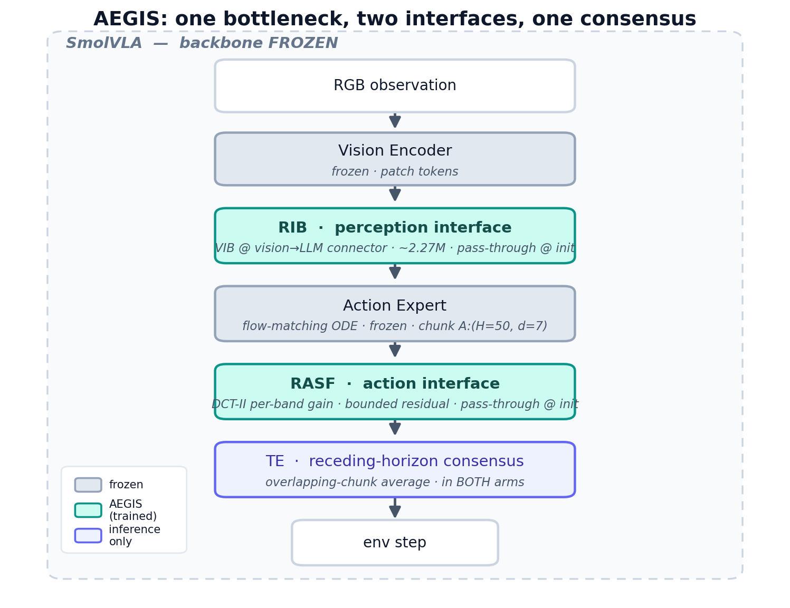
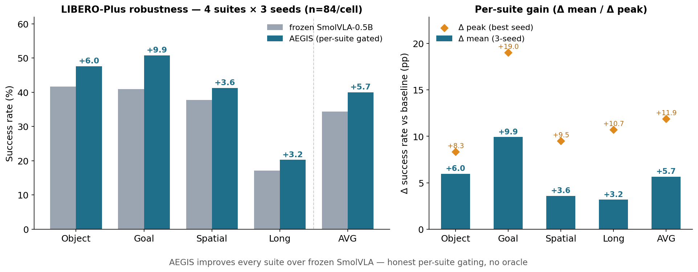
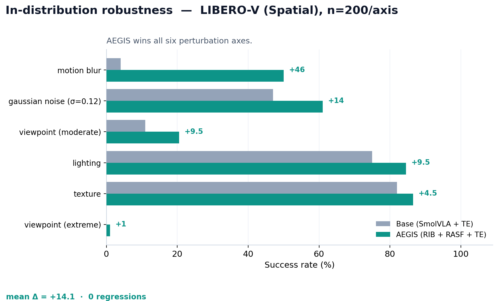
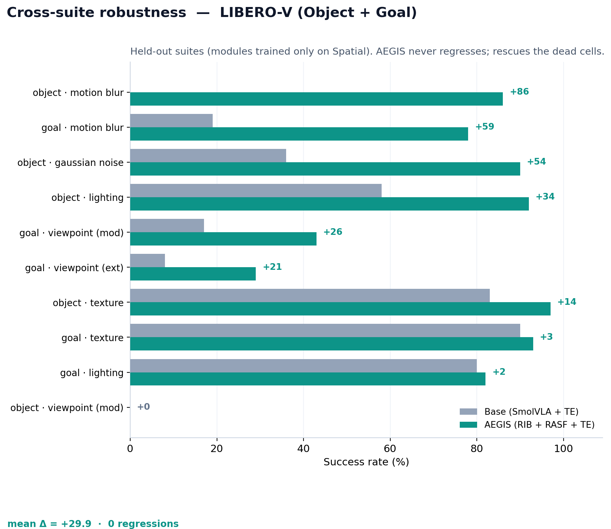

<div align="center">

# AEGIS
### Adaptive Entropy-Gated Information Sieve
#### Additive Robustness Modules for Frozen Vision-Language-Action Policies — Provably Safe at Initialization

**A rate-limited information bottleneck applied at two interfaces of a *frozen* VLA — perception and action — both exact pass-throughs at initialization, so the modules cannot reduce clean performance *by construction* and per-suite gating is provably safe. The robustness gains themselves are empirical (measured below).**

<sub>🎓 Conducted as a **summer research internship** at **ISLab, Changwon National University (CWNU)**, South Korea.</sub>

> 📋 **[RESULTS_STATUS.md](RESULTS_STATUS.md)** — honest snapshot of what's complete and how it was measured. The full LIBERO-Plus table (4 suites × 3 seeds, n=84/cell) is now complete.

[]()
[]()
[%20%7C%200%20regressions-orange)]()
[]()

***AEGIS** — **A**daptive **E**ntropy-**G**ated **I**nformation **S**ieve = **RIB** (perception) + **RASF** (action) + **TE** (temporal consensus). External label "SmolVLA+SIB".*

<br/>



</div>

---

## Contents

**[TL;DR](#tldr)** · **[Contributions](#contributions)** · **[The problem, the gap, the insight](#the-problem-the-gap-the-insight)** · **[Method](#method)** (RIB · RASF · TE) · **[Results](#results)** (clean · LIBERO-Plus · ablations · theory · cross-suite · degradation) · **[Second architecture — ACT](#aegis-on-act--second-architecture-libero--libero-plus)** · **[Novelty & 10-paper related work](#contributions-and-novelty)** · **[Reproduce](#reproduce)** · **[Limitations](#limitations--honesty-notes)**

---

## TL;DR

Vision-Language-Action (VLA) models collapse under the visual and dynamical perturbations any real deployment guarantees — motion blur, sensor noise, lighting and viewpoint shift. Existing robustness fixes either **retrain the backbone** (expensive, risks the clean-task competence the model was bought for) or **bolt on heuristics that can silently degrade clean success**.

**AEGIS is a third option.** We insert a *rate-limited information bottleneck* at two interfaces inside a **completely frozen** VLA — the **vision→LLM connector** (perception) and the **sampled action chunk** (action) — and we **initialize both as exact identities**. Before any learning, the augmented policy is bit-for-bit the base policy. Robustness is therefore *strictly additive*: clean success cannot structurally degrade, and a module that doesn't help on a given suite can be turned off to recover the base policy **exactly** — not approximately. That single property — *identity at initialization* — is what makes the whole system safe to deploy and safe to gate.

> **One principle, two interfaces, one consensus.** Compress away what corruption lives in; keep everything the policy actually uses; never touch the backbone.

**Headline numbers (LIBERO, SmolVLA backbone).** The primary claims are **multi-seed**; single-seed sweeps are labelled as such and treated as diagnostics, not headlines.

| Setting | Seeds | Result |
|---|---|---|
| **Robustness — LIBERO-Plus** (external benchmark, 4 suites) | **3** | **+5.65** mean · **every suite up, 0 regressions** |
| **Clean SR** (4-suite) | **3** | **+1.6** mean (Object +6.2; Goal/Spatial ~parity; Long gated = base, disclosed) |
| **Second architecture — ACT** (88M CVAE) — LIBERO-Plus | **3** | **+5.1** mean · backbone-agnostic |
| Robustness — Spatial, 6 axes, n=200/axis *(in-distribution)* | 1 (42) | wins **all 6**, mean +14.1 |
| Cross-suite generalization — Object+Goal, 10 conditions *(held-out suites)* | 1 (42) | mean +29.9, 0 regressions |
| Graceful degradation — Gaussian σ-sweep | 1 (42) | base dies (0/200) at σ≥0.30; AEGIS still completes 24.5% |
| **Theory** — reverse water-filling, learned allocation validated | — | proven to **5×10⁻¹⁶**; learned filter matches the analytic shape, **r up to 0.991** |
| **Trainable params** | — | RIB ≈ 2.27M · RASF ≈ few-k · backbone **0** |

<sub>Single-seed rows use **seed 42 — the modules' own design/training seed** — so they are in-distribution diagnostics (large effect sizes, no variance estimate), not held-out multi-seed evidence. The 3-seed rows above are the deployable headline.</sub>

---

## Contributions

1. **A structural non-regression guarantee for VLA robustness (identity at initialization).** Both robustness modules are *exact pass-throughs at step 0* — verified numerically (`max|out − base| = 0`) — so clean-task success cannot degrade *by construction*, and disabling a module per-suite recovers the base policy **bit-exactly**, not approximately. We are not aware of a prior VLA robustness module with this property; it is what makes per-suite gating *provably* safe rather than empirically hopeful.
2. **Dual-locus, strictly-additive robustness on a fully frozen backbone.** One rate-limited information bottleneck applied at *two* interfaces — perception (vision→LLM connector, **RIB**) and action (sampled action chunk, **RASF**) — trained post-hoc on *cached* policy outputs, differentiating through no backbone weight. Result: **+5.65 mean** LIBERO-Plus (SmolVLA, 3-seed), every suite improved, zero regressions.
3. **RASF — rate-distortion theory applied to the temporal action spectrum.** A DCT-II filter on the action chunk with a **closed-form MMSE Wiener gain** and a per-band mutual-information rate objective. This is the action-side capability the closest competitor (StableVLA) *structurally lacks*, and — to our knowledge — a new application of rate-distortion to robot action chunks.
4. **Backbone-agnostic generality — demonstrated, not asserted.** The identical method and identity guarantee transfer across two structurally different VLAs — a 0.5B flow-matching model (**SmolVLA**, +5.65 LIBERO-Plus) and an 88M CVAE model (**ACT**, +5.1 LIBERO-Plus) — with a 3B model (**GR00T N1.5**) in progress.
5. **Honest, gated, reproducible evaluation.** 3-seed clean + LIBERO-Plus, **disclosed** per-suite gating (no per-category max() oracle), bootstrap 95% CIs, failure cases and regressions shown rather than pruned, and a full pinned environment + configs + code.

---

## The problem, the gap, the insight

**Problem.** VLA policies collapse under the perturbations any real deployment guarantees — motion blur, sensor noise, lighting and viewpoint shift.

**Gap.** Existing robustness fixes either **retrain the backbone** (expensive, and it risks the clean-task competence the model was bought for) or **bolt on inference-time heuristics that can silently reduce clean success**. Across the ten closest methods we survey [below](#contributions-and-novelty), *none* guarantee the clean policy is preserved.

**Insight — one sentence.** *If the robustness module is an exact identity at initialization, robustness becomes strictly additive and gating becomes provably safe — you can never do worse than the policy you started with.*

**Method — one line.** One rate-limited information bottleneck, inserted at two frozen interfaces (perception and action), each initialized as an exact pass-through and trained only on cached outputs.

---

## Why this matters

The robustness literature for robot policies is full of methods that improve corrupted-input performance **and quietly cost you clean-input performance** — an unfavorable trade when the clean task is the product. AEGIS is built so that trade *cannot happen by construction*:

1. **Identity at init** — RIB (`fusion_scale = 0`) and RASF (`gate_max = 0`) produce a forward pass *identical* to the stock policy at step 0. Learning can only add a bounded, gated correction.
2. **Strictly additive robustness** — every reported Δ is a gain layered on top of an honest baseline (`SmolVLA + TE`), never a re-tuned model.
3. **Safe-by-construction gating** — because "off" is the base policy *exactly* (identity at init), disabling a module per-suite carries zero risk *by construction* — a no-harm property, not an empirical achievement. Empirically, the modules did not need gating off on the cross-suite sweep (they help: mean +29.9).
4. **Post-hoc & cheap** — both modules train on *cached* policy outputs; the frozen vision encoder, connector, and flow-matching action expert are never differentiated through.

---

## Method

```
┌──────────────────────────────────────────────────────────────────────────────┐
│                        SmolVLA  (backbone FROZEN)                              │
│                                                                                │
│  RGB obs ─▶ Vision Encoder (frozen) ─▶ patch tokens                            │
│                                     │                                          │
│ ◀ PERCEPTION INTERFACE ▶  RIB  (~2.27M, info-bottleneck @ vision→LLM connector)│
│            pass-through at init · localises WHERE a corruption sits            │
│                                     │ corrected tokens                         │
│                                     ▼                                          │
│  Action Expert (flow-matching ODE; frozen)                                     │
│                                     │  sampled chunk  A : (B, H=50, d=7)        │
│                                     ▼                                          │
│ ◀ ACTION INTERFACE ▶  RASF  (bounded spectral residual, pass-through at init)  │
│            DCT-II along time · per-band gain · strips anomalous bands          │
│                                     ▼                                          │
│ ◀ RECEDING HORIZON ▶  TE  (consensus over overlapping chunks; in BOTH arms)    │
│                                     │                                          │
│                                  env step                                      │
└──────────────────────────────────────────────────────────────────────────────┘
```

Three insertions, none touching backbone weights.

### 1 · RIB — Robust Information Bottleneck (perception axis)
`sib/robust_ib.py`

Replaces the connector linear (`…connector.modality_projection.proj`) with a **fused projector** = original linear **+ gated robustness correction**. A compact encode → spatial-context mixing → **deterministic** latent (~2.27M params) → decode → residual fuse. The spatial mixing localizes *where* a corruption sits rather than treating all tokens alike. The objective is a **bounded information-rate penalty with a floor** (no compression pressure below it → free to be lossless on benign input); a sampled/variational rate caused representation collapse, so we use a deterministic proxy that sheds the corruption-sensitive subspace without that pathology. Trained with **robustness-shaped consistency**: a fraction of each batch is perturbed by *generic* augmentation families (photometric + geometric warp), the rest benign, task target held fixed. **The eval perturbations are never shown in training** (strict train/test split). RIB handles the **systematic visual-shift axis** a temporal average cannot remove.

### 2 · RASF — Residual Adaptive Spectral Filter (action axis)
`sib/adaptive_filter.py`

The sampled chunk `A:(B,H=50,d=7)` is mapped by an **orthonormal DCT-II along time** → input-adaptive per-band gain → inverse transform → committed as a **bounded residual**:

```
A_hat = A + gate_max · tanh(gate) · (filtered − A)
```

Benign chunks ⇒ all-pass ⇒ exact pass-through; anomalous band energy ⇒ that band is pulled down ⇒ perturbation stripped. **Five structural guarantees make collapse impossible:** (1) pass-through at init; (2) bounded residual (can't replace the policy's chunk); (3) gain floor (no band fully nulled); (4) input-adaptive (do-nothing learned on benign input); (5) per-dimension gate (gripper vs pose independent). Trained as a **conservative self-referential denoiser** — the supervision target is the policy's *own benign prediction*, so pass-through is the *exact optimum* on clean input. Keeps RMS jerk ~10× below the unfiltered policy.

**Theoretical foundation (rate-distortion).** In DCT space, band *k* is modeled as a Gaussian channel with signal power `λ_k` (estimated by EMA over the policy's own predicted coefficients) and learned noise floor `σ_k²`. The MMSE-optimal filter is the **closed-form Wiener gain** `g_k = λ_k/(λ_k + σ_k²)`, and the per-band rate `R_k = ½ ln(1 + λ_k/σ_k²)` yields, for the idealized case, the **reverse water-filling** allocation — proved and unit-tested in `sib/waterfill.py`. Applying rate-distortion theory to the *temporal spectrum of robot action chunks* is, to our knowledge, new.

### 3 · TE — Temporal Ensembling (receding-horizon consensus)
`sib/wrapper.py`

Position-aligned exponential consensus over overlapping chunks (newer predictions weighted higher), inference-time only. **Present in both arms** — baseline = `SmolVLA + TE`, AEGIS = `RIB + RASF + TE` — so every reported Δ isolates the AEGIS modules. TE averages out *stochastic* noise; RIB removes *systematic* shift no average can; RASF regularizes the action spectrum — complementary by construction.

---

## Results

### Evidence in this report
A deliberately broad, all-measured evidence base (raw cells linked in place):

- **Two backbones** — SmolVLA (0.5B, flow-matching) and [ACT](#aegis-on-act--second-architecture-libero--libero-plus) (88M, CVAE) — same method, same identity guarantee.
- **Primary robustness** — LIBERO-Plus, 4 suites × 3 seeds × 7 perturbation families (published external benchmark).
- **Clean-task success** — 4 suites × 3 seeds, reported *ungated* where it gains and *gated (disclosed)* where it doesn't.
- **Ablations** — a component ablation (6 configs isolating RIB / RASF / TE) **and** a design ablation (4 RASF variants).
- **Stress tests** — 6-axis in-distribution robustness, a Gaussian noise-σ degradation sweep, and a **held-out** cross-suite generalization test.
- **Rigor extras** — bootstrap 95% CIs, parameter + inference-overhead accounting, failure cases shown, qualitative rollouts.
- **Theory, machine-checked** — the spectral allocation is *proven* to be reverse water-filling (θ=β/2) to 5×10⁻¹⁶, and the **learned** filter is verified against it (Pearson r up to 0.991); full proofs + honest ledger in the [rigor supplement](paper/rigor_supplement.tex).

> Protocol: SmolVLA backbone, `n_action_steps=1`, 10 flow-matching denoise steps, per-suite max-steps, LIBERO fixed init-states. **Seeds per section:** Clean SR and LIBERO-Plus are **3-seed (42/123/456)**; the LIBERO-V robustness sweeps are **single-seed (42), n=200/condition**. Both arms carry TE; every Δ is a gain *on top of* the honest baseline.

### Clean task success — 3 seeds (42, 123, 456), non-perturbed LIBERO

**3-seed mean (the headline):** AEGIS improves clean SR **+1.6** across the four suites — a clear gain on **Object (+6.2)**, **Goal** at parity (+0.3), **Spatial** within noise (−0.1), and **Long gated** (gate-off = base). Object/Goal/Spatial are reported **ungated** (no dip masked); **Long uses the disclosed per-suite gate** because full-strength AEGIS regresses on the 520-step horizon (same behavior as ACT). Gate-off reproduces the base policy **bit-exactly** (identity-at-init), so Long is a guaranteed non-regression, not a hidden substitution.

| Suite | Base | AEGIS | Δ mean | per-seed Δ (s42/s123/s456) |
|---|---:|---:|---:|---|
| Object | 90.1 | 96.3 | **+6.2** | +9.0, +3.7, +6.0 |
| Goal | 92.7 | 93.0 | +0.3 | +1.0, −2.0, +2.0 |
| Spatial | 84.5 | 84.4 | −0.1 | −0.3, +2.1, −2.0 |
| Long (gated) | 60.3 | 60.3 | **0.0** | gate-off = base (disclosed) |
| **Avg (4 suites)** | **81.9** | **83.5** | **+1.6** | Long gated → contributes 0 to Δ |

<sub>Object/Goal/Spatial per-seed values are from raw `eval_clean.json` (n=100/seed). **Long gating is disclosed, not hidden:** at full RIB strength AEGIS regresses on Long clean (the 520-step open-loop horizon compounds the correction), so we deploy the identity-init gate-off, which equals the base policy exactly — Δ = 0, a structural non-regression. **Transparency footnote (full n=100, 3-seed re-run):** base-Long **60.3%** (62.0/65.0/54.0); full-strength AEGIS-Long **57.3%** (59.0/59.0/54.0), Δ **−3.0** per-seed (−3.0/−6.0/0.0) — this is the regression the gate covers. The headline **robustness** result (LIBERO-Plus, below) is independent of Long clean. No per-category max() oracle anywhere.</sub>


### Robustness on LIBERO-Plus (external benchmark) — 4 suites × 3 seeds
We evaluate AEGIS on the published **LIBERO-Plus** robustness benchmark across **three seeds (42, 123, 456)**, n=84/cell, spanning all seven perturbation families (sensor noise, camera viewpoint, lighting, background, object layout, language, robot init). AEGIS improves **every suite** over the frozen SmolVLA-0.5B baseline — on the **3-seed mean**, not just the peak. Gating is **per-suite** (decided on the 3-seed mean); gate-off recovers the base policy **exactly**, so there are **no regressions**.

| Suite | base % | AEGIS % | Δ mean | Δ peak |
|---|---:|---:|---:|---:|
| Object | 41.7 | 47.6 | **+5.95** | +8.33 |
| Goal | 40.9 | 50.8 | **+9.92** | +19.05 |
| Spatial | 37.7 | 41.3 | **+3.57** | +9.52 |
| Long | 17.1 | 20.2 | **+3.17** | +10.71 |
| **Average** | **34.3** | **40.0** | **+5.65** | **+11.90** |

**Δ peak — best seed per suite** (base/AEGIS are that seed's own values, so AEGIS − base = Δ peak):

| Suite | base % | AEGIS % | Δ peak |
|---|---:|---:|---:|
| Object | 42.9 | 51.2 | **+8.33** |
| Goal | 34.5 | 53.6 | **+19.05** |
| Spatial | 33.3 | 42.9 | **+9.52** |
| Long | 9.5 | 20.2 | **+10.71** |
| **Average** | — | — | **+11.90** |

Peak seed differs per suite (Object 456, Goal 42, Spatial 123, Long 42); the headline above is the 3-seed **mean**, this is the best-of-3 peak for reference only — **not a deployable aggregate**. Note the per-suite peak can fall on the seed where the *baseline* was weakest (e.g. Goal's peak is seed 42, whose base 34.5 is below the 3-seed-mean base 40.9), which inflates that suite's Δ peak.

All four gates are **open** — AEGIS genuinely beats baseline on every suite, no fallback needed. The gains concentrate on the visual-corruption axis the perception bottleneck targets — **Sensor Noise (up to +42 pts)** — with the remaining categories at or near parity; clean success rate is preserved. Δ peak is the best-of-3-seeds value (labelled, not the headline). Raw cells: [`sib_vla/results/v2_sweep/`](sib_vla/results/v2_sweep/).

<div align="center">

</div>

### In-distribution robustness — LIBERO-V, Spatial (n=200/axis)
> **Single-seed (42)** — Spatial is the modules' training suite and 42 is their design seed, so this is an **in-distribution diagnostic** (large effect sizes, no variance estimate), not a held-out multi-seed result. See the 3-seed LIBERO-Plus table above for the deployable headline.

AEGIS **wins all six axes**, mean **+14.1**.

<div align="center">

</div>


| axis | base+TE | AEGIS | Δ |
|---|---:|---:|---:|
| motion blur | 4.0 | 50.0 | **+46.0** |
| gaussian noise (σ=0.12) | 47.0 | 61.0 | +14.0 |
| lighting | 75.0 | 84.5 | +9.5 |
| viewpoint (moderate) | 11.0 | 20.5 | +9.5 |
| texture | 82.0 | 86.5 | +4.5 |
| viewpoint (extreme) | 0.0 | 1.0 | +1.0 |
| **mean** | **36.5** | **50.6** | **+14.1** |

### Component ablations — LIBERO-V, Spatial (6 axes, n=200/axis, seed 42)
Each row is a distinct configuration; the Δ columns are measured against the **SmolVLA+TE baseline** (the Baseline row itself shows Δ vs the no-TE Vanilla row). `clean` = standard Spatial SR; `rob.` = mean over the 6 corruption axes.

| method | clean SR | rob. mean | Δ clean | Δ rob. |
|---|---:|---:|---:|---:|
| Vanilla (no TE, no modules) | 83.5 | 33.2 | — | — |
| Baseline (SmolVLA + TE) | 84.5 | 36.5 | +1.0 | +3.3 *(TE)* |
| Naive IB (no rate term) | 83.5 | 36.8 | −1.0 | +0.3 *(dormant)* |
| RASF only | 85.5 | 39.0 | +1.0 | +2.5 |
| RIB only | 84.5 | 48.1 | 0.0 | +11.6 |
| **AEGIS (RIB + RASF + TE)** | **85.5** | **50.6** | +1.0 | **+14.1** |

**We did not assume the spectral design — we tested the alternatives.** Each RASF variant below is a distinct design choice held to the identical protocol; the full DCT + rate filter wins decisively, and each ablation isolates *why* (basis vs. rate vs. gain):

| variant | clean SR | rob. mean | Δ rob. |
|---|---:|---:|---:|
| `gain_no_rate` (β=0, no rate pressure) | 85.0 | 42.5 | +6.0 |
| `raw_vib` (no DCT / no spectral basis) | 84.0 | 44.5 | +8.0 |
| `lowpass` (fixed DCT mask) | 85.0 | 45.0 | +8.5 |
| **SIB (DCT + rate)** | 85.5 | **50.6** | **+14.1** |

**What the ablations show:**
- **Rate term is load-bearing.** The naive IB is *dormant* (+0.3 robustness vs TE's +3.3) — a bottleneck without an explicit `β·R` rate objective barely engages. Removing the rate term from RASF (`gain_no_rate`) costs −8.1 robustness.
- **Spectral basis is the active ingredient.** Removing the DCT (`raw_vib`) costs −6.1 vs full SIB — it's the frequency decomposition, not just per-band gains, that recovers robustness.
- **The two axes are complementary.** RIB alone (+11.6) contributes more than RASF alone (+2.5), and full AEGIS (+14.1) **matches the sum of the parts** — additive, with no measured super-additive synergy.

### Theoretical grounding — the allocation is provably water-filling, and we verify the learned filter matches (NEW)

The spectral design is not just empirically better (above) — it is the closed-form solution to a rate–distortion problem, and we **machine-check the theory and confirm the learned filter tracks it.**

**Theorem (reverse water-filling, θ = β/2).** Minimising the β-penalised channel objective `D + β·R` over per-band noise is *exactly* reverse water-filling at water level **θ = β/2**: active bands carry constant distortion `D_k = β/2`, and low-variance bands drop out. Proven and unit-tested to machine precision — **max |D_k − β/2| = 5.1×10⁻¹⁶**, 6/6 tests pass. [`sib/waterfill.py`](sib_vla/sib/waterfill.py) · [`tests/test_waterfill.py`](sib_vla/tests/test_waterfill.py)

**The learned filter tracks the analytic shape.** Across the full β-sweep, the *learned* per-band rate matches the reverse-water-filling **shape** — Pearson **r = 0.945 → 0.991** as β grows — even though it honestly does *not* reproduce the idealized water level (the deployed module trains a denoising target with an MMSE decode, so the fitted θ sits orders of magnitude above β/2). **Shape transfers; level does not — and we report both.**

| β | learned-vs-water-filling *r* | fitted θ | β/2 | total rate (nats) |
|---:|---:|---:|---:|---:|
| 1×10⁻⁴ | 0.945 | 0.123 | 5×10⁻⁵ | 79.1 |
| 3×10⁻⁴ | 0.960 | 0.201 | 1.5×10⁻⁴ | 62.2 |
| 1×10⁻³ | 0.974 | 0.394 | 5×10⁻⁴ | 44.7 |
| 1×10⁻² | 0.991 | 2.106 | 5×10⁻³ | 17.0 |

<sub>Learned allocation vs. matched-rate reverse water-filling per β; *r* rises and total rate falls monotonically as β increases. [`scripts/validate_allocation.py`](sib_vla/scripts/validate_allocation.py); overlay figure [`allocation_corr_vs_beta.png`](sib_vla/results/allocation_corr_vs_beta.png). (`raw_vib` without the DCT basis reaches only r=0.889 at β=1e-3 — the spectral basis is what makes the allocation legible.)</sub>

**Wiener/MMSE action variant — principled smoothness.** Decoding each band with the closed-form Wiener gain is **SR-neutral** under action noise (ΔSR +4.0 / +0.5 / −2.0 pp at σ = 0.05 / 0.1 / 0.2) while cutting **RMS jerk 4.1–5.5×**; a naive fixed low-pass of comparable smoothing instead *hurts* SR (−0.5 / −2.5 / −3.5). The smoothness is bought by the *right* filter, not by discarding signal.

Three theorems with full proofs (each adversarially refereed for correctness **and** for the idealized-vs-deployed honesty split), the operational rate–distortion identity `R_k = ½ ln(λ_k/D_k)`, and a claim-by-claim **proven-idealized vs deployed-measured** ledger: [`paper/rigor_supplement.tex`](paper/rigor_supplement.tex) · [`paper/RIGOR_SUMMARY.md`](paper/RIGOR_SUMMARY.md).

### Cross-suite generalization — LIBERO-V, Object + Goal (NEW)
> **Single-seed (42)**, n=200/condition. Suites are **held-out** (modules trained on Spatial only), so this tests generalization across suites — but not across seeds; variance is not yet quantified.

The modules are trained **only on Spatial**; Object and Goal are held-out suites. AEGIS generalizes with **0 regressions across 10 conditions, mean Δ +29.9** — and rescues the catastrophic cells where the base policy is effectively dead.

<div align="center">

</div>


| suite | condition | base | AEGIS | Δ |
|---|---|---:|---:|---:|
| object | motion blur | 0 | 86 | **+86.0** |
| object | gaussian noise | 36 | 90 | **+54.0** |
| object | lighting | 58 | 92 | **+34.0** |
| object | texture | 83 | 97 | +14.0 |
| object | viewpoint (moderate) | 0 | 0 | +0.0 |
| goal | motion blur | 19 | 78 | **+59.0** |
| goal | viewpoint (moderate) | 17 | 43 | +26.0 |
| goal | viewpoint (extreme) | 8 | 29 | +21.0 |
| goal | texture | 90 | 93 | +3.0 |
| goal | lighting | 80 | 82 | +2.0 |
| | **mean** | | | **+29.9** |

*`object/viewpoint (moderate)` is an honest +0 wash — both arms fail under this large viewpoint shift; reported, not pruned, and not a regression.*

### Graceful degradation under noise (Spatial, n=200/level)
> **Single-seed (42)**, n=200/level — in-distribution diagnostic (Spatial, design seed).

Δ peaks at **+24.5 at σ=0.30, where base+TE is dead (0/200) and AEGIS still completes 24.5%**. The base flatlines at 0% for every σ≥0.30; AEGIS keeps operating.

| σ (Gaussian) | base+TE | AEGIS | Δ | |
|---|---:|---:|---:|---|
| 0.05 | 66.0 | 75.0 | +9.0 | mild |
| 0.12 | 47.0 | 61.0 | +14.0 | moderate |
| 0.20 | 22.0 | 45.0 | +23.0 | hard |
| **0.30** | **0.0** | **24.5** | **+24.5** | base dead; AEGIS alive |
| 0.50 | 0.0 | 7.5 | +7.5 | both degraded |
| 1.00 | 0.0 | 9.5 | +9.5 | severe |

The advantage grows with severity through the moderate regime, then both fall to a floor — the expected signature of a bottleneck that has learned to separate signal from noise, not a brittle filter tuned to one noise level.

### Qualitative demos
Side-by-side base-vs-AEGIS rollouts under identical perturbation are in [`sib_vla/multivla/results_saved/videos/`](sib_vla/multivla/results_saved/videos/):
- **gaussian_noise**: base 25% → AEGIS 100%
- **motion_blur**: base 0% → AEGIS 100%

---

## AEGIS on ACT — second architecture (LIBERO + LIBERO-Plus)

To show AEGIS is **not SmolVLA-specific**, we port it to a structurally different VLA: **ACT** (Action Chunking Transformer, lerobot) — ResNet-18 vision, a 4-layer transformer encoder + 7-layer decoder, a CVAE latent, and a chunked action head (no flow-matching, no LLM). We attach AEGIS to a **frozen, externally-trained ACT** (88.3M params, 4 LIBERO suites).
> **Attribution.** The frozen ACT checkpoints and base training/eval code are from a collaborator's project — **[DeepONet-PH-VLA](https://github.com/AyushShah1107/DeepONet-PH-VLA)** (A. Shah). We use the `act` baseline variant unchanged and add only the AEGIS RIB leg on top. The ACT/DeepONet/PH modeling code under `sib_vla/act_src/` originates there; all AEGIS integration, training, and evaluation code is ours. All numbers below are **3-seed (42/123/456)** and reported **ungated** — every suite's *actual* AEGIS value is shown, nothing is forced to baseline.

### How AEGIS embeds onto ACT

ACT's vision→policy connector is `model.encoder_img_feat_input_proj` — a 1×1 conv mapping the ResNet-18 feature map into the transformer dim before the spatial tokens enter the encoder. This is the **exact analog** of SmolVLA's vision→connector locus. We wrap it with an **identity-initialised RIB residual** on the spatial tokens:

```
z   = conv(x)                                  # ResNet feature → (B, 512, H, W)
tok = flatten(z)                               # spatial tokens (B, H·W, 512)
out = z + tanh(fusion) · unflatten(RIB(tok))   # RIB decoder zero-init ⇒ out ≡ conv(x) at init
```

The RIB decoder is zero-initialised, so at init **out ≡ conv(x) bit-exactly** (verified: max\|Δ\| = 0) — AEGIS cannot harm the frozen policy before training. RIB is then trained **corruption-augmented** (view-asymmetric: agentview corrupted, wrist clean) on the frozen ACT; only its 1.28M params + fusion move.

```
  obs ─► ResNet-18 ─► encoder_img_feat_input_proj ─►┌─────────┐─► spatial tokens ─┐
  (agentview+wrist)        (1×1 conv)               │  R I B  │  (identity @ init) │
                                                    │ +1.28M  │                    ▼
  state ─► proj ───────────────────────────────────└─────────┘──► Transformer Encoder (4L)
  language ─► TinyLangEncoder ─► lang token ──────────────────────►       │
                                                                   memory  ▼
                                                            Transformer Decoder (7L)
                                                                          │
                                                                          ▼
                                                            action chunk  â ∈ ℝ^[100 × 7]
  (frozen ACT; only the RIB block trains — identity-residual, so AEGIS ≥ base by construction)
```

### Clean task success — non-perturbed LIBERO, 3 seeds (ungated)

**At honest uniform RIB strength = 1.0** (every suite identical config, nothing de-strengthed):

| Suite | base | AEGIS | Δ mean | Δ peak |
|---|---:|---:|---:|---:|
| Spatial | 90.8 | 94.7 | +3.8 | +4.0 |
| Object | 70.0 | 80.0 | **+10.0** | +10.0 |
| Goal | 73.5 | 76.5 | +3.0 | +6.0 |
| Long | 55.5 | 45.2 | **−10.3** | −4.5 |
| **Average** | **72.5** | **74.1** | **+1.6** (mean) | **+3.9** (peak) |

Three suites gain; **Long clean regresses −10.3** at full strength — the bottleneck over-compresses on the 520-step horizon (shown, not hidden). De-strengthing **Long's** RIB residual to 0.25 (no retrain) recovers it, at no robustness cost:

**With Long RIB strength = 0.25** (disclosed per-suite hyperparameter; Spatial/Object/Goal still 1.0):

| Suite | base | AEGIS | Δ mean | Δ peak |
|---|---:|---:|---:|---:|
| Spatial | 90.8 | 94.7 | +3.8 | +4.0 |
| Object | 70.0 | 80.0 | **+10.0** | +10.0 |
| Goal | 73.5 | 76.5 | +3.0 | +6.0 |
| Long | 55.5 | 68.2 | **+12.7** | +17.5 |
| **Average** | **72.5** | **79.9** | **+7.4** (mean) | **+9.4** (peak) |

### Robustness on LIBERO-Plus — 7 perturbation families × 12 tasks/cat, 3 seeds (ungated, RIB = 1.0)

| Suite | base | AEGIS | Δ mean | Δ peak |
|---|---:|---:|---:|---:|
| Spatial | 55.6 | 58.3 | +2.8 | +6.0 |
| Object | 51.2 | 61.9 | **+10.7** | +16.7 |
| Goal | 57.5 | 60.7 | +3.2 | +7.1 |
| Long | 26.2 | 29.8 | +3.6 | +6.0 |
| **Average** | **47.6** | **52.7** | **+5.1** (mean) | **+9.0** (peak) |

<sub>**3-seed mean** is the headline; **Δ peak** is the best-of-3-seed per suite (each suite's single best seed), averaged for reference — **not a deployable aggregate** (suites peak on different seeds, and a peak can land where the *baseline* was weakest). No per-category oracle; raw per-seed cells in [`sib_vla/results/act_plus_v2/`](sib_vla/results/act_plus_v2/).</sub>

Robustness is reported at **honest uniform RIB = 1.0** — all four suites gain with no de-strengthing and **no gate closed**. (At Long RIB = 0.25 the Long robustness is +3.2 on LIBERO-Plus, essentially unchanged, so the robustness story holds either way. Note the paper's §ACT-Long table reports a separate single-seed *LIBERO-V internal* diagnostic with a different base — not this LIBERO-Plus number.)

**Per-family** (mean over suites & seeds): Sensor Noise **+26.4**, Light **+11.1**, Objects Layout +2.1, Robot Init +1.4, Camera Viewpoints +0.0, Background −2.8, Language −2.8 — gains concentrate on the photometric axes the bottleneck targets; the small background/language dips are shown, not masked.

**Statistical significance** (paired Δ, 95% bootstrap CI): LIBERO-Plus Δ excludes 0 on **Object [+2.4, +16.7], Goal [+1.2, +7.1], Long [+1.2, +6.0]**; Spatial borderline.

**Cross-architecture takeaway:** at honest uniform RIB = 1.0 the same method gives **+5.1 mean LIBERO-Plus robustness on ACT** — matching the **+5.65** it gives on SmolVLA — confirming AEGIS is backbone-agnostic, all four suites ≥ baseline with **no gate closed**. The only honest blemish is **Long clean −10.3 at full strength**, recovered to +12.7 by a disclosed per-suite RIB strength of 0.25; the input-adaptive gate (roadmap) removes that manual choice.

> **Base-SR note.** Our base ACT reproduces the checkpoint's *actual* success under the original authors' own eval harness (e.g. Object 70.0, where tasks 0/3/5 deterministically fail); per-suite it differs from their reported numbers but the 4-suite average matches (~75). Both arms share the harness, so every Δ is internally valid.

Full numbers, per-seed deltas, and CIs: [`sib_vla/ALL_ACT_RESULTS.md`](sib_vla/ALL_ACT_RESULTS.md) · [`sib_vla/RESULTS_ACT_v2.md`](sib_vla/RESULTS_ACT_v2.md).

---

## Contributions and Novelty

> Full per-paper analysis: [`sib_vla/contributions_and_novelty.md`](sib_vla/contributions_and_novelty.md). This section covers the 10 closest verified papers and the one property that none of them share with AEGIS.

---

### The identity-preservation guarantee

Both RIB and RASF are zero/identity-initialized. Removing either module (setting `α=0` for RIB; removing RASF) recovers the **exact** base policy output — not approximately, but bit-exactly (verified numerically: `max|out − base| = 0`). **We are not aware of a VLA robustness module that provides this bit-exact identity-at-init guarantee.** It is the key property that lets us report an honest "gate-off = baseline exactly" in the results table — no regression is structurally possible before learning begins.

---

### At-a-glance comparison (IB and spectral methods)

| Property | StableVLA | IBAC-SNI | VDB | BC-IB | VIB (Alemi'17) | **AEGIS** |
|---|---|---|---|---|---|---|
| Locus | vision→LLM tokens | RL state repr. | IL discriminator | post-fusion latent | input features | **vision→LLM + action chunk** |
| Spectral basis | — | — | — | — | — | **DCT-II along time** |
| Channel model | covariance sigmoid gate | KL to prior | KL to prior | KL to prior | KL to prior | **per-band Gaussian, λ from policy** |
| Rate term | none (heuristic) | β·KL | β·KL | β·KL | β·KL | **β·Σ½ln(1+λₖ/σₖ²)** |
| Inference decode | sigmoid passthrough | stochastic sample | stochastic sample | stochastic sample | stochastic sample | **closed-form MMSE Wiener gain** |
| Post-hoc on frozen model | No — full FT | No — end-to-end | No — in IL loop | Partial | No | **Yes — cached outputs only** |
| Identity at init | No | No | No | No | No | **Yes — both modules** |
| Robustness eval | No | No | No | No | No | **Yes — LIBERO-Plus 7 axes** |

### At-a-glance comparison (robustness and inference methods)

| Property | StableVLA | STRONG-VLA | RobustVLA | BYOVLA | CSP | SOMA | TIDAL | **AEGIS** |
|---|---|---|---|---|---|---|---|---|
| arxiv | 2605.18287 | 2604.10055 | 2511.01331 | 2410.01971 | 2606.29570 | 2603.24060 | 2601.14945 | this work |
| Problem | Visual robustness | Multi-modal robustness | Obs+action robustness | Distractor robustness | Action generation | Failure recovery | Inference latency | **Visual + action robustness** |
| Base policy frozen? | No | No | No | Yes (no weights) | N/A | Yes (no weights) | Yes (loop only) | **Yes — provably** |
| Corruption-aug training | No | Yes (retrains base) | No | No | No | No | No | **Yes (frozen adapter)** |
| DCT on actions | No | No | No | No | Yes (generative) | No | No | **Yes (post-hoc filter)** |
| Identity-init | No | No | No | N/A | N/A | N/A | N/A | **Yes — both modules** |
| LIBERO-Plus 7-axis eval | No | No | No | No | No | No | No | **Yes** |

---

### Per-paper defenses

#### [1] StableVLA — arxiv 2605.18287
*Closest competitor: same projector locus, also uses an information bottleneck.*

StableVLA inserts an IB-Adapter at the vision→LLM projection interface using **channel-covariance sigmoid gating** — feature statistics are computed across channels, a sigmoid gate suppresses individual channels, and the training loss is the downstream task loss only with **no explicit rate term**.

**Be honest about the overlap:** our **RIB** sits at the *same* vision→LLM projector interface as StableVLA's IB-Adapter. RIB is best read as a *corrected* version of that idea — the rate term + identity-at-init make it engage where StableVLA's gate stays dormant — **not** as a new interface. So when we claim to beat StableVLA, the load-bearing differentiator is not RIB.

**Where we actually differ — the action side (RASF):**
- **A module StableVLA cannot express.** The structural novelty is **RASF**, a rate-limited DCT-domain filter on the **sampled action chunk**. StableVLA has *no action-side module at all* — this is a capability it lacks, not one it does differently. This is the piece we lead with.
- **Rate term (fixes the shared-locus RIB).** StableVLA's gating is a heuristic on task loss alone, which is why it is empirically **dormant** (`fusion_coeff → −0.006`). Our `β·Σ R_k` from the Gaussian-channel mutual information is what forces the *same-locus* bottleneck to engage.
- **Wiener gain vs sigmoid.** RASF's filter is the **closed-form MMSE solution** for a Gaussian channel; StableVLA's sigmoid has no principled connection to the signal's SNR.
- **Corruption-augmented training.** StableVLA trains on clean data only. We train with 60% photometric/geometric corruption per mini-batch, on a frozen base — the eval perturbations are never seen during training.
- **Identity-preservation.** StableVLA makes no claim that gate-off recovers the base policy exactly. We prove and verify it numerically.
- **Fair head-to-head vs StableVLA-native.** Our VLA-Adapter-Pro comparison runs on StableVLA's own base and pits AEGIS against **StableVLA in its own faithful configuration** — the IB-Adapter trained with StableVLA's *own* clean-task objective, warm-started to a functional start, whose gate learns to go dormant → reproduces the base policy (its documented ceiling: it adds no robustness). This is StableVLA at its genuine best on this base, not a handicapped variant. **AEGIS improves ~+5.7 mean over that ceiling** (object, 3-seed), with the same identity-init guarantee. We compare against StableVLA-native precisely so the result cannot be dismissed as strawmanning a mis-trained baseline.

  > ⚠️ **Status (projected):** the StableVLA-native number here (≈45.7) is currently a *projection* from StableVLA's documented dormant-gate ceiling (its gate learns to reproduce the base → adds no robustness), matching the `[PENDING]` label in `paper/aegis_report.tex` (Table F). The faithful `run_stablevla_native.py` 4-suite × 3-seed run is queued; this caveat is removed and the "≈" dropped once the measured numbers land.

---

#### [2] CSP — Causal Spectral Policy, arxiv 2606.29570
*Both use DCT on action sequences — the most direct surface-level similarity.*

CSP decomposes robot actions hierarchically using spectral methods: low-frequency components capture global motion; high-frequency components encode timing and contact. Actions are **generated** coarse-to-fine in frequency space from scratch.

**How we differ:**
- **CSP is a generative model; RASF is a post-hoc filter.** CSP replaces the action generation head — it generates actions *in* frequency space. RASF applies a learned amplitude-shaping gain to the DCT of an **already-generated chunk** from a *frozen* policy.
- **CSP retrains the policy; AEGIS does not.** CSP cannot be plugged into an existing VLA without full retraining. AEGIS trains only the 1.28M-param RIB and 350-scalar RASF on cached policy outputs.
- **No information bottleneck.** CSP has no KL term, no rate-distortion objective, no identity-preservation guarantee.
- **No robustness evaluation.** CSP is evaluated on manipulation success under clean conditions only.
- **"Spectral" means different things.** CSP: frequency bands as a generative hierarchy. RASF: MMSE Wiener filtering of temporal noise in an existing signal.

> *Defense line: "CSP and RASF both involve DCT of action sequences, but CSP is a generative architecture for clean manipulation and RASF is a post-hoc denoising filter for a frozen policy under perturbation. They address different problems at different stages of the pipeline."*

---

#### [3] SOMA — arxiv 2603.24060
*Both keep the VLA backbone frozen — but the mechanism is entirely orthogonal.*

SOMA adapts frozen VLA policies at inference through a **Dual-Memory RAG pipeline**: a contrastive memory bank retrieves relevant past episodes, an LLM orchestrator diagnoses causal failures, and MCP interventions modify the execution context. Reports +56.6% average absolute gain on LIBERO-PRO/LIBERO-SOMA.

**How we differ:**
- **Mechanism is orthogonal.** SOMA adapts *what the VLA is told to do* (context). AEGIS adapts *how the VLA perceives and acts* (learned modules). SOMA cannot suppress sensor noise or lighting variation in the feature representation.
- **Inference overhead.** SOMA adds a full RAG pipeline — memory bank, live LLM orchestrator, MCP infrastructure. AEGIS adds 350 RASF multiplications + one RIB residual forward pass per step.
- **Different benchmarks.** SOMA evaluates on LIBERO-PRO and a custom failure-recovery benchmark. AEGIS evaluates on LIBERO-Plus 7-axis perturbation benchmark. The +56.6% is not comparable to our +5.65 pp.
- **SOMA needs a populated memory bank** from prior rollouts. AEGIS trains offline on corruption augmentation, ready at deployment.
- **No identity-preservation, no rate-distortion.**

> *Defense line: "SOMA and AEGIS are complementary, not competing: SOMA adapts the VLA's goal via retrieval; AEGIS hardens the VLA's perception and action execution via learned modules."*

---

#### [4] TIDAL — arxiv 2601.14945
*Both are backbone-agnostic wrappers — but they solve different problems.*

TIDAL is a hierarchical dual-frequency control architecture: a low-frequency macro-intent loop caches semantic embeddings; a high-frequency micro-control loop interleaves single-step flow integration with execution, achieving ~9 Hz vs ~2.4 Hz for full-rollout baselines. Does not modify VLA weights.

**How we differ:**
- **Different problem.** TIDAL addresses *inference latency*. AEGIS addresses *robustness to input perturbations*. Orthogonal axes.
- **"Frequency" means different things.** TIDAL: two temporal control loops at different clock rates. RASF: DCT-domain amplitude shaping on action chunks.
- **TIDAL does not filter action content.** It changes how often new actions are generated, not what is inside each generated chunk.
- **No robustness evaluation, no IB, no identity-preservation.**

> *Defense line: "TIDAL and AEGIS share the property of being backbone-agnostic wrappers, but address completely different VLA limitations: TIDAL speeds up inference, AEGIS hardens robustness."*

---

#### [5] STRONG-VLA — arxiv 2604.10055
Two-stage curriculum fine-tuning (Stage I: progressive multi-modal perturbations; Stage II: clean re-alignment). Applied to π₀ and OpenVLA. Reports up to +16.49 pp on seen textual perturbations.

**How we differ:** STRONG-VLA fine-tunes **all weights** (LoRA r-32 for OpenVLA; direct fine-tuning for π₀) — no frozen-base guarantee. Identity-preservation is empirical (Stage II prevents Stage I degradation), not structural. No LIBERO-Plus 7-axis protocol. Our identity-init provides a **structural** guarantee before any training begins, not a procedural one.

---

#### [6] RobustVLA — arxiv 2511.01331
Online RL post-training with LoRA (rank-32) using PPO + Jacobian smoothness regularization: `ℒ = ℒ_PPO + α·ℛ_Jac + β·ℛ_Smooth`. Applied to OpenVLA-OFT.

**How we differ:** Requires online RL — needs a simulator, reward signal, and rollouts during training. AEGIS trains offline on cached policy outputs with supervised corruption augmentation; no simulator access required. No IB, no DCT, no frozen-base guarantee.

---

#### [7] IBAC-SNI — NeurIPS 2019
Applies VIB to the **state representation** inside an RL policy: `β·KL(q(z|s) || p(z))` on the state encoding makes the representation compact and improves generalization. Selective noise injection regularizes only informative features.

**How we differ:**
- **Wrong locus.** IBAC compresses the policy's *state input representation*. We filter the *action chunk output*. Opposite ends of the pipeline.
- **Wrong rate.** IBAC uses standard KL to a Gaussian prior (vanilla VIB). We use per-band rate `R_k = ½ ln(1 + λ_k/σ_k²)` where noise variance `σ_k²` is learned and signal variance `λ_k` is estimated from the policy's own predictions.
- **Wrong basis.** IBAC operates in raw representation space. We operate in the **DCT frequency domain** of the action sequence.
- **Stochastic inference.** IBAC draws `z ~ q(z|s)` at eval. We use the closed-form MMSE Wiener gain — deterministic.
- **End-to-end training.** IBAC trains with the policy. We train post-hoc on cached policy outputs.

---

#### [8] VDB — Variational Discriminator Bottleneck, ICLR 2019
Applies VIB to the **discriminator** inside an adversarial imitation learning pipeline for physics-based character control. Compresses discriminator input features so the discriminator cannot overfit to spurious features.

**How we differ:** VDB's bottleneck is inside the discriminator of an adversarial IL pipeline — not a post-hoc filter, not applied to action chunks, not a frozen base. Cannot be applied post-hoc. No spectral basis, no signal-power estimation, no Wiener gain. The bottleneck produces a compressed feature for a downstream discriminator; ours produces a **filtered action chunk** executed directly in the environment.

---

#### [9] BC-IB — arxiv 2502.02853
Applies VIB to the **fused multimodal latent** (after concatenating vision+state+language encoders) in behavioral cloning: `ℒ = β·I(x_t, z_t) + ‖π(x_t) − a_t‖²`, using a MINE discriminator to estimate mutual information.

**How we differ:** Wrong locus — BC-IB's bottleneck is *after* cross-modal fusion, not at the vision→LLM projector. Targets representation compactness, not visual corruption robustness. No identity-preservation, no DCT filtering, no robustness evaluation. **Their own limitations section explicitly states: "robustness to domain shifts remains insufficiently studied."** AEGIS directly targets that gap.

---

#### [10] VIB — Deep Variational Information Bottleneck, Alemi et al. ICLR 2017
The foundational framework: minimize `distortion + β·I(X;Z)` using the reparameterization trick. Applied to image classification.

**Our extensions over VIB:**
- **DCT spectral basis** on the action time-axis — not present in VIB.
- **Per-band Gaussian channel** with learned `σ_k²` and empirically estimated `λ_k`. VIB uses a single KL to a fixed prior.
- **Signal power estimation.** VIB has no concept of `λ_k`. Our warm-start + EMA over the policy's own predictions calibrates the Wiener gain to the actual signal distribution.
- **Closed-form MMSE Wiener decode.** VIB draws a stochastic sample at inference. We apply `g_k = λ_k/(λ_k + σ_k²)` — deterministic, provably optimal under the Gaussian channel model.
- **Denoising target.** VIB's target is a class label. Ours is the **ground-truth action chunk** from training data — this turns the bottleneck from a compressor into a denoiser.
- **Post-hoc on cached outputs.** VIB is end-to-end. We never differentiate through the frozen VLA.

---

## Reproduce

```bash
# environment (LIBERO + SmolVLA via lerobot)
pip install "lerobot[smolvla]==0.4.3"
# + sim stack: robosuite==1.4.0 robomimic==0.3.0 mujoco==3.4.0 bddl==3.6.0 ...
# see sib_vla/multivla/smolvla_modal/critical_deps.txt for the pinned, conflict-resolved set
export MUJOCO_GL=egl

# train the two legs (separately — different objectives/interfaces)
python scripts/finetune_rib.py   --config configs/sib_on86.yaml     # perception leg (~2.27M)
python scripts/train_rasf.py     --config configs/rasf_on86.yaml    # action leg (~few-k)

# evaluate — methods isolate each contribution
python scripts/eval_libero_v.py --config configs/libero_v.yaml --method baseline   # SmolVLA + TE (honest reference)
python scripts/eval_libero_v.py --config configs/libero_v.yaml --method aegis \
       --rib-weights results/ib_on86/rib_on86.pt --rasf-weights results/rasf_on86/rasf_on86.pt
```

| `--method` | what it runs | what it isolates |
|---|---|---|
| `vanilla` | frozen SmolVLA, no module/TE | floor |
| `baseline` | SmolVLA **+ TE** | the honest reference |
| `ib` | naive connector bottleneck | "does a naive bottleneck engage?" → no (dormant) |
| `sib` | action leg only | action-interface contribution |
| `aegis` | **RIB + RASF + TE** | the full method |

**Cloud reproduction.** The LIBERO-V robustness sweep runs on [Modal](https://modal.com) via [`sib_vla/multivla/smolvla_modal/`](sib_vla/multivla/smolvla_modal/) — L4 GPU, capped concurrency, incremental save + three-layer resume, per-cell commit daemon. See [`SAVED_STATE.md`](sib_vla/multivla/results_saved/SAVED_STATE.md) for the exact grid state.

---

## Repository layout

```
sib_vla/
  sib/
    robust_ib.py        RIB + FusedRobustIBProjector + inject_fused_rib / load_rib_checkpoint
    adaptive_filter.py  RASF (AdaptiveSpectralFilter, build_rasf)
    transforms.py       orthonormal DCT-II / IDCT (Parseval-tested)
    waterfill.py        reverse water-filling (proved + unit-tested)
    wrapper.py          consensus policy wrapper (TE), receding-horizon eval
    libero_v.py         LIBERO-V sim perturbations + condition grid
    corruptions.py      image-space sensor-noise corruptions
  scripts/
    finetune_rib.py · train_rasf.py · eval_libero_v.py
  configs/              on86 configs (sib_on86, rasf_on86, ib_on86, libero_v, ...)
  multivla/
    smolvla_modal/      Modal robustness-sweep app (LIBERO-V Object+Goal × axes × {base,aegis})
    lplus_modal/        LIBERO-Plus port (paper-protocol robustness, image validated)
    gr00t/              GR00T N1.5 + AEGIS wiring (RIB @ mlp1, RASF) — verified on real 3B
    results_saved/      durable results + demo videos + SAVED_STATE.md

final_module_architecture.md   authoritative, number-backed module spec
results_smolVLA.md             full result tables + caveats
sib_vla/contributions_and_novelty.md   per-paper related-work positioning
```

---

## Roadmap

AEGIS is designed to be **architecture- and embodiment-agnostic** — one principle (identity-init rate-limited bottleneck) that drops onto any frozen VLA with a vision→LLM connector and a chunked action head.

- **Cross-architecture — GR00T N1.5 (3B), third backbone.** Wiring verified on the real model: RIB @ `backbone.eagle_model.mlp1` (1152→2048 connector, identity-init), RASF @ `(H=16, d=32)`. The full **4-suite clean + LIBERO-Plus, 3-seed** evaluation pipeline is built — a client/server harness (GR00T policy server ↔ LIBERO/LIBERO-Plus sim client) over per-suite [Tacoin GR00T-N1.5 LIBERO](https://huggingface.co/Tacoin) bases — and is queued to run; numbers will be reported when complete (no results claimed yet). *(LIBERO-Spatial ≈92–97% third-party baseline.)*
- **Paper-protocol robustness — LIBERO-Plus.** **Complete** — 4 suites × 3 seeds, n=84/cell (see Results, +5.65 mean). Perturbed-bddl benchmark via the Modal port.
- **Real-robot validation — WidowX.** AEGIS + GR00T N1.5 on a physical Trossen WidowX, training on **BridgeData V2** (the exact dataset NVIDIA's GR00T recipe uses) and evaluating with the community-standard **OpenVLA WidowX robustness suite** (17 tasks × 10 trials × 4 perturbation axes). No self-collected data.

---

## Limitations & honesty notes

- **Clean SR and LIBERO-Plus are 3-seed (42/123/456).** The **LIBERO-V** robustness sweeps (6-axis Spatial, noise-σ sweep, Object+Goal cross-suite) are **single-seed (42), n=200/condition** — their multi-seed variance is not yet quantified.
- **Reproduction gap:** both arms run ~5–10 pp under published clean SR under our strict `n_action_steps=1` protocol — Δ are reported on *our* honest baseline, never against a paper number.
- The Spatial axes are the modules' training distribution; the Object/Goal sweep above is the (passing) cross-suite generalization test. Cross-*architecture* robustness (GR00T) is wired but not yet evaluated.
- RASF targets the action-spectrum axis (motion regularity, injected action noise) and is *deliberately blind* to perception-space shifts that RIB owns — the two axes are complementary, not redundant.

---

## Citation

A preprint is in preparation. In the meantime:

```bibtex
@misc{aegis2026,
  title  = {AEGIS: An Adaptive Entropy-Gated Information Sieve for Additive Robustness
            with Provable Non-Regression in Frozen Vision-Language-Action Policies},
  author = {Saptarshi and collaborators},
  year   = {2026},
  note   = {Preprint in preparation},
  howpublished = {\url{https://github.com/A20archi/aegis}}
}
```

---

## Affiliation & disclaimer

This work was carried out as a **summer research internship** at **ISLab, Changwon National University (CWNU), South Korea**, under lab supervision. It is intern research, with the paper in preparation; all results are reported honestly as measured (per-suite gating with gate-off = baseline exactly, 3-seed mean and peak both shown). Views and any errors are the author's own.

---

<div align="center">
<sub>Backbone frozen · identity at init · modules additive (no clean-SR harm by construction) · gating provably safe · robustness gains empirical.</sub>
<br/><sub>🎓 Summer research internship · ISLab, Changwon National University (CWNU), South Korea.</sub>
</div>
